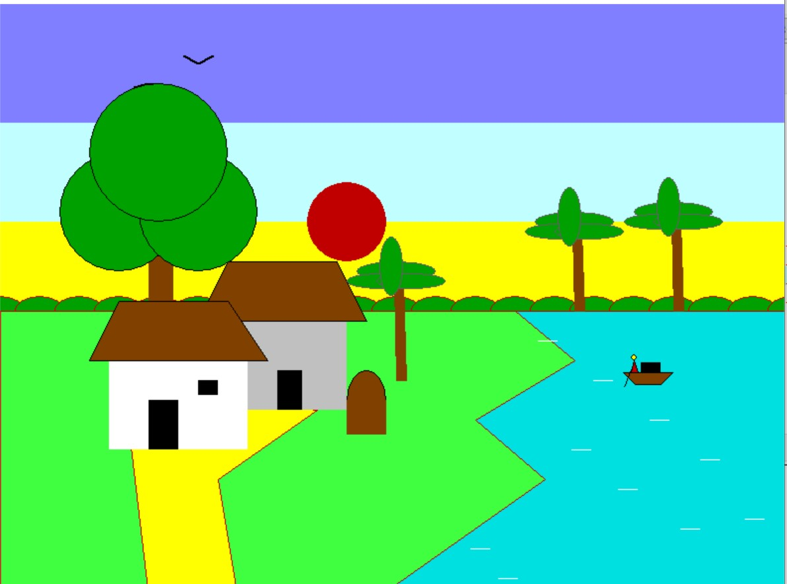

# Dynamic Landscape & Weather Simulator

An interactive 2D environmental simulation built in C++ using the legacy `graphics.h` library. The application renders a living village ecosystem complete with dynamic day/night cycles, real-time weather alterations, wave physics, and procedural object animations.

## 📸 Visual Preview

Below is a snapshot of the native desktop application rendering the village environment:



## 🚀 Key Features

*   **Dynamic Weather Engine:** On-the-fly environmental state toggles including clear skies, rain, and snow.
*   **Day & Night Cycle:** Full visual state transformation shifting from vibrant daytime gradients to a star-rendered night sky.
*   **Procedural Wave Animation:** Uses trigonometric math (`sin()`) to drive realistic river currents and object/boat tilting.
*   **Sprite Pathing & Kinematics:** Automated translation paths for flying birds, a docking riverboat, and walking pedestrian sprites.
*   **Persistent Color Palettes:** Custom logic hooks ensuring specific foliage assets maintain structural color integrity across global lighting shifts.

## 🛠️ Technical Stack

*   **Language:** C++ (ISO/IEC 14882)
*   **Graphics Driver:** Borland Graphics Interface (BGI) via `<graphics.h>`
*   **Math Engine:** Trigonometric functions via `<math.h>` for wave simulation and phase tracking.

## ⌨️ Interactive Controls

Run the application locally and use the following keyboard keys to manipulate the live environment:
*   `s` : Switch weather mode to **Sunny**
*   `r` : Switch weather mode to **Rain**
*   `c` : Switch weather mode to **Cloudy / Snow**
*   `n` : Trigger **Day / Night Transition**

## 🔧 Local Installation & Setup

To compile and run this code locally as a desktop application, you must use an IDE configured for the vintage 32-bit BGI graphics framework.

### Recommended IDEs
*   **Code::Blocks** (configured with the `WinBGIm` package)
*   **Dev-C++** (with the C++ Graphics toolpack pre-installed)

### Compilation Linker Flags
Ensure your compiler's linker options include the following system library flags to prevent build failures:
```bash
-lbgi -lgdi32 -lcomdlg32 -luuid -loleaut32 -lole32
```

## 📜 License
This project is open-source and available under the [MIT License](LICENSE).
